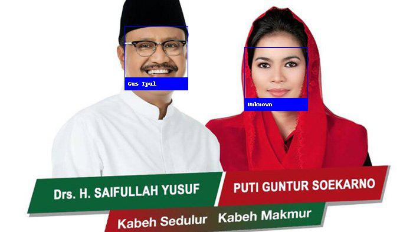

# Face recognition +Training data with CNN Model

[](https://nodesource.com/products/nsolid)

[](https://travis-ci.org/joemccann/dillinger)

Project ini akan memperkenalkan bagaimana komputer mengenali kontur wajah anda dan mengidentifikasi anda dengan label yang sudah anda _set_, project ini berjalan di ***Python3.7***. yang ada dalam project ini yaitu
  - Data example (Train data dan Test data)
  - Train Data
  - Check Data

## Requirement
  - Python3.7
  - ***optional*** Virtualenv
  - dlib [for Windows 7, 8, 10](https://medium.com/@vinuvish/install-dlib-python-windows-77e9349e6cfc) or [Unix](https://gist.github.com/ageitgey/629d75c1baac34dfa5ca2a1928a7aeaf)

## How to install
- Clone this repository
- Change state directory to new clone repository
- Get virtualenv and active virtualenv
- ```$ pip install -r requirement.txt```

## Example
```sh
$ python train_data.py
$ python check_data.py
```

## Hasil perbandingan


## Thanks
* Many, many thanks to [Davis King](https://github.com/davisking) ([@nulhom](https://twitter.com/nulhom)) for creating dlib and for providing the trained facial feature detection and face encoding models used in this library. For more information on the ResNet that powers the face encodings, check out his [blog post](http://blog.dlib.net/2017/02/high-quality-face-recognition-with-deep.html).
* Thanks to everyone who works on all the awesome Python data science libraries like numpy, scipy, scikit-image, pillow, etc, etc that makes this kind of stuff so easy and fun in Python.
* Thanks to [Cookiecutter](https://github.com/audreyr/cookiecutter) and the [audreyr/cookiecutter-pypackage](https://github.com/audreyr/cookiecutter-pypackage) project template for making Python project packaging way more tolerable.
